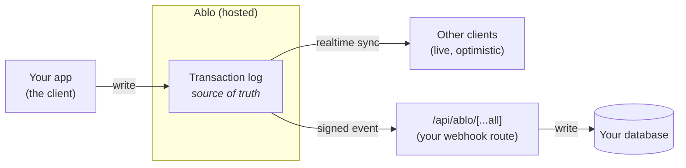
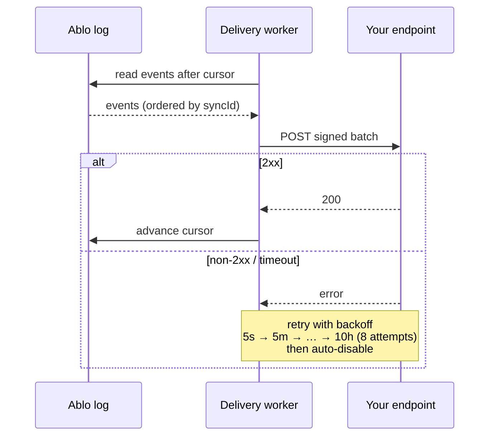

Ablo owns the ordered transaction log — the source of truth. **Webhooks are how
that log reaches your database.** Ablo streams every committed change to an
endpoint in your app as a signed event; your handler writes your own database.

It's the same two-sided shape as Stripe: you call Ablo to make changes (the
client), and Ablo calls you to persist them (this webhook). Ablo never holds your
database credentials.

## The loop



There are two ways data flows out of Ablo, and they're for different jobs:

| | reaches | use it for |
|---|---|---|
| **Realtime** (`useAblo`, WSS) | your live UI | instant, optimistic rendering |
| **Webhooks** (this page) | your database | a durable copy you own — analytics, backups, server logic |

Most apps use both: the realtime stream for the UI, the webhook stream to keep
their database in sync. This page is the webhook stream.

If you know Stripe, you already know the shape:

| Stripe | Ablo |
|---|---|
| `stripe.x.create(...)` — make the change | the Ablo client — make the change (+ live sync) |
| `/stripe-webhook` — confirm and persist | `/api/ablo/[...all]` — persist into your database |
| Stripe owns the charges | Ablo owns the transaction log |
| you mirror charges into your database | you mirror the log into your database |

The difference in Ablo's favor: every event carries `syncId`, a monotonic log
position, so you can both dedupe **and** apply in order — Ablo guarantees the
order because it owns the log.

## The event object

Every delivery is a batch of events. Each event:

| field | meaning |
|---|---|
| `type` | `"<model>.<verb>"`, e.g. `task.updated` |
| `model` | the model name (`task`) — the table to write |
| `objectId` | the changed row's id |
| `data` | the post-change row, or `null` on delete (like Stripe's `event.data.object`) |
| `syncId` | monotonic log position — **dedupe and order by this** |
| `id` | `String(syncId)` — the event id |
| `createdAt` | ISO commit timestamp |

```ts
import type { AbloWebhookEvent } from '@abloatai/ablo/webhooks';
```

## 1. Create a handler

`npx ablo init` scaffolds this for you at `app/api/ablo/[...all]/route.ts`. If
your project uses Prisma it's a **working generic mirror** — one upsert/delete
for every model, no per-model code. Otherwise it's a neutral route with a single
place to plug your database in.

```ts app/api/ablo/[...all]/route.ts
import { Webhook } from 'svix'; // any Standard Webhooks library
import type { AbloWebhookEvent } from '@abloatai/ablo/webhooks';
import { PrismaClient } from '@prisma/client';

const wh = new Webhook(process.env.ABLO_WEBHOOK_SECRET!);
const prisma = new PrismaClient();

type ModelDelegate = {
  upsert(a: { where: { id: string }; create: Record<string, unknown>; update: Record<string, unknown> }): Promise<unknown>;
  delete(a: { where: { id: string } }): Promise<unknown>;
};

export async function POST(req: Request): Promise<Response> {
  const body = await req.text(); // RAW body — required to verify
  let batch: { data: AbloWebhookEvent[] };
  try {
    batch = wh.verify(body, Object.fromEntries(req.headers)) as { data: AbloWebhookEvent[] };
  } catch {
    return new Response('invalid signature', { status: 400 });
  }

  const delegates = prisma as unknown as Record<string, ModelDelegate | undefined>;
  for (const event of [...batch.data].sort((a, b) => a.syncId - b.syncId)) {
    const model = delegates[event.model];
    if (!model) continue; // a model you don't mirror — skip
    if (event.data === null) {
      await model.delete({ where: { id: event.objectId } }).catch(() => {});
    } else {
      await model.upsert({ where: { id: event.objectId }, create: event.data, update: event.data });
    }
  }

  return new Response(null, { status: 200 }); // 2xx = delivered
}
```

You only edit this if your tables **diverge** from Ablo's schema (renamed
columns, extra side effects) — add a `case` for that model before the generic
mirror. If your tables match Ablo's, you never touch it.

<Note>
Return a `2xx` quickly. Any other status is a failure and is retried. Do heavy
work asynchronously after responding.
</Note>

## 2. Test locally

You don't register a `localhost` URL. `npx ablo dev` forwards committed changes
to your machine with a local signing secret — the same idea as Stripe's
`stripe listen`. Run your app, run `ablo dev`, and writes flow into your local
handler.

## 3. Register your endpoint

For a deployed URL, register it once. Ablo mints the signing secret and returns
it a single time — the CLI writes it straight into your `.env.local`.

```bash
npx ablo webhooks create https://yourapp.com/api/ablo/[...all]
# ✓ Registered we_… → https://yourapp.com/api/ablo/[...all]
# ✓ Wrote ABLO_WEBHOOK_SECRET to .env.local (shown once)
```

Manage and inspect endpoints:

```bash
npx ablo webhooks list          # endpoints + delivery health (status, cursor, last error)
npx ablo webhooks roll <id>     # mint a fresh signing secret
npx ablo webhooks enable <id>   # re-enable a disabled endpoint
```

Or call the API directly — the org is derived from your secret key:

```bash
curl https://api.abloatai.com/api/v1/webhook_endpoints \
  -H "authorization: Bearer $ABLO_API_KEY" \
  -H "content-type: application/json" \
  -d '{ "url": "https://yourapp.com/api/ablo/[...all]" }'
# → { "id": "we_…", "secret": "whsec_…", "status": "enabled", ... }
```

## 4. Verify the signature

Ablo signs every request with the [Standard Webhooks](https://www.standardwebhooks.com)
scheme (the spec Svix authored). Verify with any compatible library — `svix` or
`standardwebhooks` — using the secret from registration. Ablo ships no
verification code of its own; you use the open library.

```ts
const wh = new Webhook(process.env.ABLO_WEBHOOK_SECRET!);
const event = wh.verify(rawBody, Object.fromEntries(req.headers));
```

Verification checks three headers — `webhook-id`, `webhook-timestamp`,
`webhook-signature` — and rejects a timestamp outside a 5-minute window (replay
protection). Always verify against the **raw** request body.

## Event delivery

Ablo delivers from a per-endpoint **cursor** over the log, advancing only on a
`2xx`. A failed delivery leaves the cursor in place, so the same events are
re-sent until they land — at-least-once, in order.



| behavior | how it works |
|---|---|
| **Ordering** | Every event carries `syncId`, a monotonic log position. Apply in `syncId` order — Ablo guarantees the order because it owns the log. |
| **Retries** | A non-`2xx` (or no response within the timeout) is retried with backoff: immediate, 5s, 5m, 30m, 2h, 5h, 10h, 10h — 8 attempts over ~32h. |
| **Auto-disable** | After the retries exhaust, the endpoint is marked `disabled` and delivery stops until you `ablo webhooks enable <id>`. |
| **Replay** | Nothing is lost on failure: the log *is* the durable buffer, and delivery resumes from the endpoint's cursor once it's healthy. |

## Best practices

- **Dedupe by `syncId`.** Skip any `syncId` you've already stored. Delivery is
  at-least-once, so the same event can arrive twice after a retry.
- **Apply in `syncId` order.** It's the log position; sort each batch by it.
- **Return `2xx` fast.** Acknowledge first, then do slow work asynchronously.
- **Subscribe to only what you need.** Set `enabledEvents` to the models you
  mirror (`['*']` is the default = all).
- **Roll secrets periodically.** `ablo webhooks roll <id>` mints a new secret;
  Standard Webhooks supports a rotation window so in-flight events still verify.
- **Verify the raw body.** Frameworks that re-serialize JSON will break the
  signature — verify the bytes you received.

## Event types

The verb is derived from the change:

| type | when |
|---|---|
| `<model>.created` | a row was inserted |
| `<model>.updated` | a row was updated |
| `<model>.deleted` | a row was deleted (`data` is `null`) |
| `<model>.archived` | a row was soft-archived |
| `<model>.unarchived` | a soft-archived row was restored |

Internal coordination changes (permissions, sync groups) carry no webhook — only
your data models produce events.
