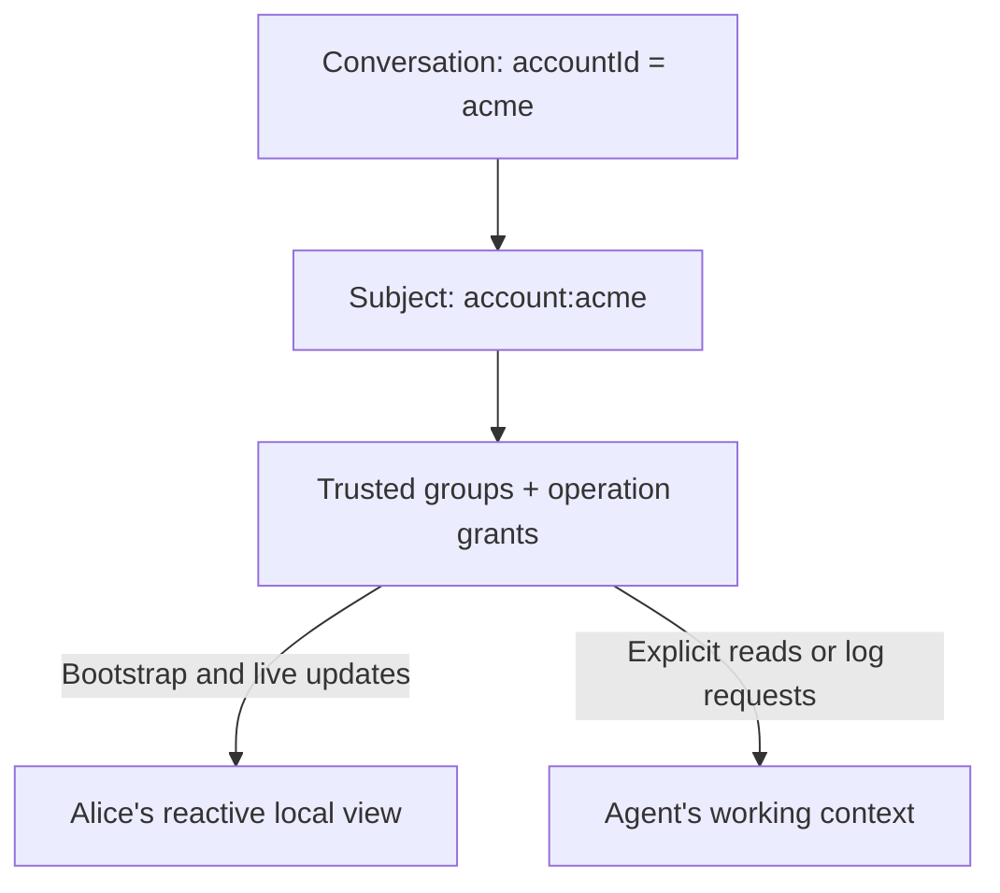

# Groups and shared context

> Structure which shared state reaches each participant, and how their view stays current.

Groups connect the structure of your data to the people and agents who receive
it. A group names a shared context, such as `account:acme` or `workspace:abc`.
Membership and authorization determine the eligible view; subscriptions and
client loading determine how that view reaches a participant.

Start here to understand **why this participant receives this record**. Use
[Identity](./identity.md) for authentication and credential issuance, and the
[account multiplayer walkthrough](./examples/account-multiplayer.md) for the
maintained application that puts these pieces together.

## One context, several decisions

Ablo has existing declarations for these decisions; there is no single group
object that configures all of them.

| Decision | Existing declaration or behavior |
| --- | --- |
| Which records form a context? | Model `groups.root` creates a group per root record; children inherit through `belongsTo` relationships marked `parent: true`. Ordinary references do not propagate membership. `groups.roles` supplies explicit field-based routes. |
| Who belongs? | Schema `groups.grants` declares a membership edge through its `subject` and `scope` relations within an organization. A trusted backend can also issue session `groups` after verifying application membership. |
| Which rows may they access? | Model `policy` establishes the read/tenant boundary; `subject` requires a matching credential group for the named row field. Delivery routing alone is not a read policy. |
| What may they do? | Session `can` grants model operations. Read membership does not grant update or claim authority. |
| Which changes reach them? | Server-authorized subscriptions match the row's delivery groups. Requested groups cannot widen credential authority. |
| What is local? | Reactive clients bootstrap and maintain local state; HTTP clients explicitly fetch data. Client loading is distinct from permission to read. |

For a model with `subject`, its subject group is the **exclusive delivery
route**. Parent groups, explicit roles and additional routes cannot provide an
alternate path to that row. For other routed models, delivery matches any
eligible group; declaring a narrow route does not narrow an otherwise broad
read policy. `groups.routingOnly: true` acknowledges that deliberate difference,
not an authorization grant.

## Follow one conversation

The account multiplayer reference declares this model:

```ts
import { defineSchema, model, z } from '@abloatai/ablo/schema';

const schema = defineSchema({
  conversations: model({
    accountId: z.string().min(1),
    title: z.string(),
    executionOwner: z.string().nullable(),
    executionState: z.enum(['idle', 'generating']),
  }, { subject: { field: 'accountId', group: 'account' } }),
});
```

A conversation whose `accountId` is `acme` requires `account:acme`. The
application verifies Alice's membership before issuing her browser session with
that group and `can: { conversations: ['read'] }`. The agent gets the same group
with `read` and `update` authority. The reference verifies account membership in
application code; it does not use a schema `groups.grants` membership model.

Both can read the conversation. Alice's browser cannot update it with its
read-only credential: the reference performs human writes through a separately
scoped server client. The agent may update it, subject to the write's claims and
read checks. An outsider cannot gain access by supplying `accountId: 'acme'` in
a filter or by requesting an unauthorized subscription.



The diagram describes data flow. Group membership does not prove that a
participant is connected, has loaded every record, or has acted on an update.
Presence describes activity; it does not grant authority or locate cached bytes.

## A participant's lifecycle

| Event | What happens today |
| --- | --- |
| Join | The backend authenticates the participant and verifies membership before minting a scoped session. Issuance does not itself load records. |
| Load | Alice's reactive client loads its authorized baseline and consumes updates. An HTTP agent calls model reads/lists or observes the ordered log; it has no reactive local graph. |
| Change | A confirmed conversation change routes through `account:acme` to eligible subscribers. An HTTP agent must explicitly read again or consume log changes to update its working context. |
| Gain a group | On the incremental group-added path, the reactive client records membership and receives covering deltas for newly visible rows. The full-diff path instead requests re-bootstrap. |
| Reconnect | The reactive client compares current server-issued groups with stored subscription metadata. Detected shrinkage clears local storage and memory and marks a full bootstrap as required; otherwise normal catch-up applies. |
| Lose a group | On a group-removal notification, the reactive client clears its managed database and object pool, updates subscription metadata and requests re-bootstrap. It does not selectively evict that group's rows. |
| Switch account | The reference disposes the previous account client and creates a client using the newly authorized account endpoint. |

Group-change handling is a runtime path, not a promise that every change in an
external membership database immediately invalidates every issued credential.
The application must connect its membership and credential lifecycle to Ablo.
An offline participant cannot process a revocation notification until it
reconnects; managed-cache clearing cannot retract copies retained by application
code or an agent. Clients configured without automatic bootstrap do not fetch
a full baseline after a group-change notification; they rely on covering deltas or
explicit reads for data.

Consider a participant authorized for both `account:acme` and `account:beta`.
Losing Acme currently clears the client's whole managed cache, including cached
Beta records, before rebuilding the remaining authorized view. Beta records
remain eligible for loading. For non-subject routing where one row belongs to
several groups, losing one matching group likewise does not alone establish
that the row is inaccessible; remaining authorization and routes matter.

## Understand the living system

Inspect a participant through three separate questions: **what may they see,
what are they subscribed to, and what have they loaded?** To explain an individual
record, follow its model's subject or routing declaration, the participant's
trusted groups and operation grants, then its client transport and lifecycle.

These distinctions also help assess a group design:

| Symptom | Design question |
| --- | --- |
| Many irrelevant updates | Is the delivery group broader than the participant's work? |
| One task needs many groups | Has the shared context been fragmented too far? |
| One change reaches many subscribers | Is that fan-out useful, and do all subscribers need live delivery? |
| Frequent group-premise rejection | Does the decision depend on the whole group, or only particular rows/fields? |
| Slow loading or catch-up | How much authorized state is being materialized, and how much changed while offline? |

These are evaluation questions, not a built-in group score or per-participant
cache dashboard. A group does not configure blob prefetch, cache placement or
selective eviction. Those would be additional capabilities built on these scope
and update signals.

## Changes and decisions

Receiving an update keeps a live view current. Declaring a read premise checks
whether a particular decision is still valid when written. A group can serve
both purposes, but membership alone neither locks records nor makes them
mutually consistent.

### Protect a decision based on a group

An agent reads workspace `A` to write document `B`. A moment later it reads `B` to write
block `C`. Between those steps someone else edits `A`. The agent is now building
`C` on a premise that has moved — and nothing about writing `C` looks wrong in
isolation. That is stale context, and it is the thing sync groups let you catch.

The recipe is one field on the commit: declare the group you read as a premise.

```ts
// The agent read everything under workspace:abc to compose this write.
await ablo.blocks.update({
  id: 'block-C',
  data: { text: revised },
  reads: [{ group: 'workspace:abc', readAt: watermark }],
});
```

At commit, inside the write transaction, the engine asks a single question: *did
any delta routed to `workspace:abc` land after `watermark`?* If nothing moved, the
write applies. If something moved, Ablo rejects the batch with a `409`, so the
agent can re-read `workspace:abc`, regenerate, and submit a fresh guarded
write. The agent never persists work built on a premise it can no longer see.

---

## How you hear about it

Three channels answer three different coordination questions. Pick by the
question you have.

```ts
// A screen that stays current.
ablo.records.onChange((docs) => render(docs));

// In React: who else is visible on this client's scoped groups?
const peers = useAblo(ablo => ablo.presence.forModel('records', documentId)) ?? [];

// Stop this write if the thing I read moved while I composed it.
const record = await ablo.records.read({ id: 's-1' });
if (!record) throw new Error('Record not found');
await ablo.blocks.update({ id, data, reads: [record] });
```

| Question | Channel | Arrives |
| --- | --- | --- |
| What do the rows say right now? | `onChange` | As deltas land, on the socket |
| Who else is working here? | `useAblo(ablo => ablo.presence.others)` over the session/client groups | As participants connect, disconnect, or change activity |
| Did the premise for **this** write move? | `reads` on the write | On that write's receipt, before it applies |

`onChange` and `useAblo(ablo => ablo.presence.others)` use the reactive client's socket. `reads` rides the
commit, so it reaches a socketless actor over HTTP too. The row returned by
`read` privately carries its model, id, and
watermark; passing that row in `reads` is enough to protect a later write. Ablo
does not retain the row contents as read evidence.

---

## Three ways a change reaches other rows

"A affects B and C" means three different things. The engine does the first two
for you and leaves the third to you — on purpose.

**Routing — who hears about a change.** Every row belongs to one or more sync
groups, and a write fans out to its delivery groups. For a model without an
exclusive `subject` route, declared scope roots and
relationships can route a block change to `block:…`, `document:…`, and
`workspace:…`, so authorized workspace subscribers receive it. This is delivery,
resolved by walking the ownership tree at commit time. It routes the change; it
never recomputes a value.

**Structural cascade — what disappears with a change.** A declared ownership
relationship can make deleting a parent remove its descendants. Clients need
routed deletion deltas to remove those records from their views. This follows
the relationship and delete path; sharing a group alone does not cascade deletes.

**Value recomputation — what a change implies for derived state.** If `B` holds a
number rolled up from `A`, the engine does not recompute `B` when `A` changes. It
surfaces that `A` moved and lets the actor decide what `B` should become. This is
the non-coercion principle: coordinate and report, resolve nothing by fiat.
Merging derived state is a judgment call, and for an agent in the loop that
judgment is the whole point.

---

## The chain: A → B → C

Model a dependency as shared group membership. Put `A` and `B` in one group, `B`
and `C` in another, and you have wired the edges of a chain. What travels along
those edges is a *signal*, one hop at a time — not a recomputation.

```
A writes ──▶ group {A,B} ──▶ B hears it
                                  │  B decides, B writes
                                  ▼
                             group {B,C} ──▶ C hears it
```

A's delta lands in `{A,B}` and stops there. `C` is not in that group, so `C`
learns nothing from A directly. `C` advances only when **B itself writes** and
that new delta lands in `{B,C}`. `B` is the translator: it takes "A moved,"
decides what that means for its own state, commits, and *its* commit is what
reaches `C`.

The direction matters. The signal flows forward, A to B to C, and each hop is a
real write an actor chose to make. Group routing supplies the delivery edges, and declared read premises add
stale-work checks to writes; the actors are
the runtime that walks them. It is closer to a dataset an analyst
recalculates cell by cell than to a reactive engine that recomputes the whole
column for you.

Two consequences worth designing around:

- **The chain runs as fast as actors react.** If `B` never acts on its signal,
  the chain stops at `B` and `C` stays as it was. Freshness is an actor
  responsibility; the engine guarantees the signal, not the follow-through.
- **Cycles don't settle themselves.** If `C` writes back to `A`, each hop is a
  separate commit with its own stale check, and nothing damps the oscillation.
  Keep the dependency graph acyclic, or give one actor the job of reaching a
  fixpoint. Convergence lives above the engine.

---

## Declaring the batch premise

`reads[]` declares what the commit was based on. Each entry is a premise, and
each governs the *whole* commit: if one goes stale, every write in the batch
rejects. You choose the granularity per entry.

```ts
reads: [
  { group: 'workspace:abc', readAt: N },                         // did anything in the workspace move?
  { model: 'Document', id: 's-1', readAt: N, fields: ['title'] }, // did this row (this field) move?
]
```

A **group** premise asks "did anything I was watching change?" — the native
Ablo granularity, and the right tool for the chain above. A **row** premise is
literal: this object, optionally these fields. A row premise with `fields`
conflicts only on real field overlap, so two actors editing disjoint fields of
the same row don't collide.

Any stale premise aborts the batch with `stale_context` (`409`). Re-read and
regenerate if the work is still relevant. Omit `reads` only when the write is
intentionally unconditional.

---

## Sizing groups

A group is the unit of both delivery and staleness, so its size is a real
tradeoff. A change fans out to every subscriber of every group it touches, and a
group premise fires when *anything* in the group moves — so a group that is too
broad wakes actors for changes they don't care about, and one that is too narrow
misses the dependency you meant to track.

Choose groups around shared work and authorized audiences. Use a group premise
when a decision depends on that whole context; use row or field premises when
it depends on less. Overlapping routing groups can express useful audiences,
but do not create transaction boundaries or a consistency guarantee.

---

## Where this is defined

- **Access**, meaning who may read or write a group, is
  [`identity.md`](./identity.md).
- **The convention** behind non-coercion, the premise, and the notification is
  [`concurrency-convention.md`](./concurrency-convention.md) (§4 and §5).
- **The mechanics**, the three coordination blocks underneath, are
  [`coordination.md`](./coordination.md).
- **Presence** is read with `useAblo(ablo => ablo.presence.others)`; active exclusions remain on the
  `claim` namespace. See [`react.md`](./react.md) and
  [`coordination.md`](./coordination.md).
